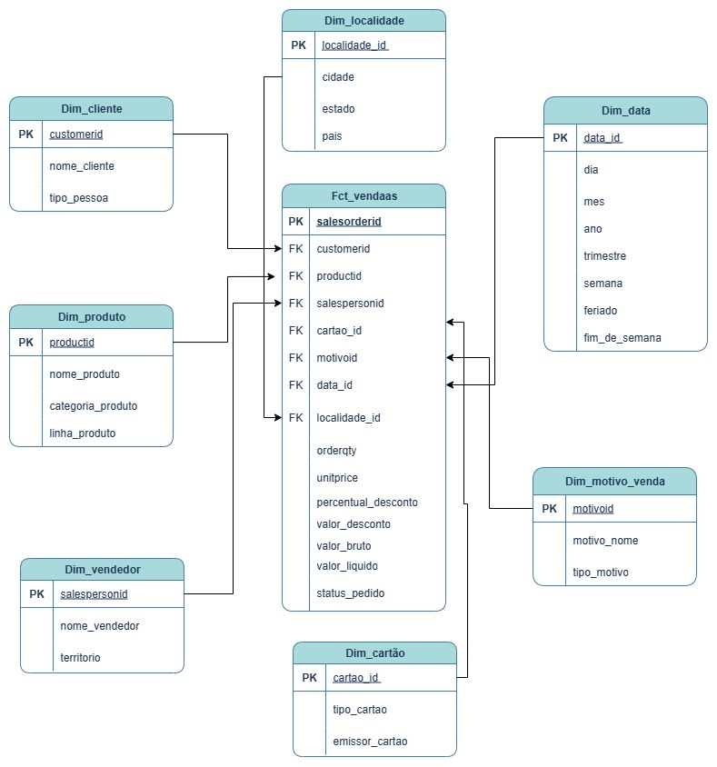

# 📊 Projeto: Analytics Engineer — Adventure Works

## 🎯 Objetivo

Este projeto simula a arquitetura de dados da empresa fictícia **Adventure Works**, com foco na aplicação de boas práticas de engenharia analítica usando **dbt (Data Build Tool)**. O principal objetivo é a modelagem dimensional, construção de pipelines ELT e validação automatizada dos dados.

---

## 🧠 Modelo Dimensional

O projeto segue uma modelagem estrela com uma tabela fato central e múltiplas dimensões relacionadas.

<h3 align="center">Esquema Dimensional</h3>

  

<em>Figura 1: Representação visual do modelo dimensional utilizado no projeto.</em>

---

## 🗂️ Tabelas Utilizadas

### 🧾 Tabela Fato

- `fct_vendas`
  - `salesorderid`
  - `customerid`
  - `productid`
  - `salespersonid`
  - `cartao_id`
  - `motivoid`
  - `data_id`
  - `localidade_id`
  - `orderqty`
  - `unitprice`
  - `percentual_desconto`
  - `valor_desconto`
  - `valor_bruto`
  - `valor_liquido`
  - `status_pedido`

### 🧱 Dimensões

| Tabela              | Chave Primária      | Principais Campos                 |
|---------------------|---------------------|-----------------------------------|
| `dim_cliente`       | `customerid`        | nome_cliente, tipo_pessoa         |
| `dim_produto`       | `productid`         | nome_produto, categoria_produto, linha_produto |
| `dim_vendedor`      | `salespersonid`     | nome_vendedor, territorio         |
| `dim_cartao`        | `cartao_id`         | tipo_cartao, emissor_cartao       |
| `dim_data`          | `data_id`           | dia, mês, ano, trimestre, semana, feriado, fim_de_semana |
| `dim_localidade`    | `localidade_id`     | cidade, estado, país              |
| `dim_motivo_venda`  | `motivoid`          | motivo_nome, tipo_motivo          |

---

## 🧪 Testes Automatizados

Testes aplicados via dbt para garantir confiabilidade:

- 🔹 `unique` nas PKs
- 🔹 `not_null` nos campos obrigatórios
- 🔹 `relationships` entre fatos e dimensões

---

Execução do Projeto: 
pip install dbt-snowflake
dbt run
dbt test
dbt docs generate && dbt docs serve

